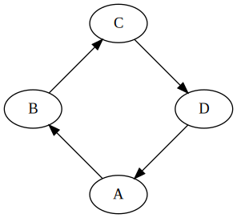

# gatsby-remark-graphviz

Intercepts code-blocks written in [DOT](<https://en.wikipedia.org/wiki/DOT_(graph_description_language)>) in your Markdown files and compiles them to SVG using GraphViz. Provides a quick and easy way to draw vector diagrams that are easy to modify and update.

This is a sub-plugin for `gatsby-transformer-remark`. As demoed below, add this plugin to the options of `gatsby-transformer-remark`.

---

This project is part of [#CreateWeekly](https://dev.to/josephuspaye/createweekly-create-something-new-publicly-every-week-in-2020-1nh9), my attempt to create something new publicly every week in 2020.

## Install

```bash
npm install --save gatsby-remark-graphviz
```

## How to use

First, install and configure the plugin as follows:

```javascript
// In your gatsby-config.js
module.exports = {
  plugins: [
    {
      resolve: 'gatsby-transformer-remark',
      options: {
        plugins: ['gatsby-remark-graphviz'],
      },
    },
  ],
};
```

Then, write Markdown code blocks containing DOT source code describing a graph, with one of the following tags to trigger the plugin:

- `circo`
- `dot`
- `fdp`
- `neato`
- `osage`
- `patchwork`
- `twopi`

These tags are GraphViz layout algorithms, and more details about them can be found in the [GraphViz user guides](https://graphviz.org/documentation/#user-guides).

By default, the first `#` comment at the start of the code block will be used as the image caption, and subsequent `#` comments at the start of the code block will be used as alt text (see **Options** below).

See [GraphViz Pocket Reference](https://graphs.grevian.org/) for an introduction to GraphViz and how to write graphs using DOT.

## Example

The following code block written in Markdown:

````md
```neato
# A diagram showing system dependencies
# A more detailed description here to use as alt text
# More alt text follows
digraph {
   A -> B
   B -> C
   C -> D
   D -> A
}
```
````

Generates the following image:

<figure>


<figcaption>A diagram showing system dependencies</figcaption>

</figure>

<br>

From the following HTML:

<details>
<summary>Click to expand</summary>

```html
<figure class="remark-graviz-figure"><div class="remark-graphviz-graph"><svg role="img" aria-label="A more detailed description here to use as alt text
More alt text follows" width="296" height="272" viewBox="0 0 222.43 204.43" xmlns="http://www.w3.org/2000/svg"><title>A more detailed description here to use as alt text
More alt text follows</title><desc>digraph {
   A -&gt; B
   B -&gt; C
   C -&gt; D
   D -&gt; A
}</desc><g class="graph"><path fill="#fff" stroke="transparent" d="M0 204.43V0h222.43v204.43H0z"></path><g class="node" transform="translate(4 200.43)"><ellipse fill="none" stroke="#000" cx="107.21" cy="-18" rx="27" ry="18"></ellipse><text text-anchor="middle" x="107.21" y="-13.8" font-family="Times,serif" font-size="14">A</text></g><g class="node" transform="translate(4 200.43)"><ellipse fill="none" stroke="#000" cx="27" cy="-98.21" rx="27" ry="18"></ellipse><text text-anchor="middle" x="27" y="-94.01" font-family="Times,serif" font-size="14">B</text></g><g class="edge" transform="translate(4 200.43)"><path fill="none" stroke="#000" d="M92.13-33.09c-12.1-12.1-29.26-29.26-42.93-42.92"></path><path stroke="#000" d="M46.62-73.65l-4.6-9.54 9.55 4.59-4.95 4.95z"></path></g><g class="node" transform="translate(4 200.43)"><ellipse fill="none" stroke="#000" cx="107.21" cy="-178.43" rx="27" ry="18"></ellipse><text text-anchor="middle" x="107.21" y="-174.23" font-family="Times,serif" font-size="14">C</text></g><g class="edge" transform="translate(4 200.43)"><path fill="none" stroke="#000" d="M42.09-113.3c12.1-12.1 29.26-29.26 42.92-42.93"></path><path stroke="#000" d="M82.65-158.81l9.54-4.6-4.59 9.55-4.95-4.95z"></path></g><g class="node" transform="translate(4 200.43)"><ellipse fill="none" stroke="#000" cx="187.43" cy="-98.21" rx="27" ry="18"></ellipse><text text-anchor="middle" x="187.43" y="-94.01" font-family="Times,serif" font-size="14">D</text></g><g class="edge" transform="translate(4 200.43)"><path fill="none" stroke="#000" d="M122.3-163.34l42.93 42.93"></path><path stroke="#000" d="M167.81-122.78l4.6 9.55-9.55-4.6 4.95-4.95z"></path></g><g class="edge" transform="translate(4 200.43)"><path fill="none" stroke="#000" d="M172.34-83.13L129.41-40.2"></path><path stroke="#000" d="M131.78-37.62l-9.55 4.6 4.6-9.55 4.95 4.95z"></path></g></g></svg></div><figcaption class="remark-graviz-figcaption">A diagram showing system dependencies</figcaption></figure>
```

</details>

## Options

| Option                    | Type    | Default                                                                                      | Description                                                                                                                                                                                                  |
| ------------------------- | ------- | -------------------------------------------------------------------------------------------- | ------------------------------------------------------------------------------------------------------------------------------------------------------------------------------------------------------------ |
| `generateAriaDescription` | Boolean | `true`                                                                                       | If `true`, generates and applies `aria-label` and `role="img"` to the SVG. Also generates `<title>` and `<desc>` at the root of the SVG. [Important for accessibility](https://stackoverflow.com/a/4756461). |
| `optimize`                | Boolean | `true`                                                                                       | If `true`, optimizes the generated SVG using [SVGO](https://github.com/svg/svgo).                                                                                                                            |
| `svgoPlugins`             | Object  | [See this](https://github.com/JosephusPaye/gatsby-remark-graphviz/blob/master/plugin.js#L10) | An object to enable or disable [SVGO optimisation plugins](https://github.com/svg/svgo#what-it-can-do). Each key is plugin name, and each value is a boolean that enables or disables the plugin.            |
| `wrapperTag`              | String  | `div`                                                                                        | The tag to wrap the generated `<svg>` element in.                                                                                                                                                            |
| `wrapperClass`            | String  | `remark-graphviz-graph`                                                                      | The class to apply to the wrapper of the generated `<svg>` element.                                                                                                                                          |
| `firstCommentIsCaption`   | String  | `true`                                                                                       | If `true`, picks the first `#` comment at the top of the DOT source and uses that to generate a figure caption for the generated image.                                                                      |
| `figureClass`             | String  | `remark-graphviz-figure`                                                                     | The class to apply to the generated `<figure>` element. Only applies when `firstCommentIsCaption` is `true`.                                                                                                 |
| `figcaptionClass`         | String  | `remark-graphviz-figcaption`                                                                 | The class to apply to the generated `<figcaption>` element. Only applies when `firstCommentIsCaption` is `true`.                                                                                             |

```javascript
// In your gatsby-config.js
module.exports = {
  plugins: [
    {
      resolve: 'gatsby-transformer-remark',
      options: {
        plugins: [
          {
            resolve: 'gatsby-remark-graphviz',
            options: {
              generateAriaDescription: true,
              optimize: true,
              svgoPlugins: {
                inlineStyles: false,
                removeTitle: false,
                wrapperTag: 'span',
                wrapperClass: 'my-graph-wapper is-fullwidth',
                firstCommentIsCaption: true,
                figureClass: 'my-graph-figure',
                figcaptionClass: 'my-graph-figcaption',
              },
            },
          },
        ],
      },
    },
  ],
};
```

## Licence

[MIT](LICENCE)
